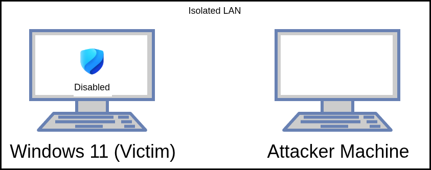

In Part 1, we talked about the sheer scale of the infostealer problem. These quiet, smash-and-grab operations bypass MFA by stealing session cookies and are fueling a massive underground economy.

Now, it’s time to actually start building my Proof of Concept (POC).

Following the Cyber Attack Kill Chain methodology we laid out in the last post, the very first stage is Weaponization. But before I can write a single line of code, I need to figure out two things: what language I am writing this in, and where I am going to safely test it.

Here is the thought process for getting the lab off the ground.

## The Target: Why Windows?


When it comes to choosing an operating system as the victim, the choice is pretty obvious: Windows. It wins by sheer volume. It’s one of the most famous and widely used operating systems in the world, especially in corporate environments.

In cybersecurity, attack surface is a numbers game. If a piece of malware lands in a random user's inbox, there is a remarkably high chance that the user is running a Windows machine. So, that's where we are aiming.

## Choosing the Weapon: Why Rust?
Technically and theoretically, you can write an infostealer in almost any modern programming language. Python, C#, C++, Go—they all have their pros and cons.

But for my use case, since this is a "learn with me" journey, I chose Rust.

Why? First off, because why not? Rust sounds cool. But honestly, I don't want to overcomplicate things with deep technical reasons I don't fully understand yet. I just chose it because it's well-known for being memory-safe, and I've been seeing and hearing a lot of people talking about it being used for malware development lately. That's good enough for me to dive in.

## The Lab Setup (Keep It Simple)
I don't want to bluff too much here—I assume if you are reading this, you are fairly technical. So, I won't bore you with a massive step-by-step tutorial on how to install an ISO file.

Instead, here is a very high-level architectural diagram of my lab environment. It consists of just two isolated Virtual Machines running on my hypervisor, sitting right next to each other on the same local network:



-> The Attacker Machine: This is where I'll be writing, compiling, and testing the Rust code.

-> The Victim (Windows 11): This is a typical, standard Windows 11 host. This is the machine that will be "infected" by the compiled payload so I can observe how the stealer behaves.

## The "Naked" Windows 11 (A Crucial Note on Defender)

Since I am just starting out and learning how to write basic low-level code, I do not want my executables getting instantly nuked and killed by Microsoft Defender before I even know if my code works.

So, for now, I am completely disabling Windows Defender and all native safety features. I am running a plain, entirely unprotected Windows 11 host.

Is this realistic to a hardened corporate environment? No. But you have to learn to walk before you can run. Once I understand the basics of data collection and exfiltration, we will gradually start turning the security features back on. Down the road, once the stealer actually works, we can move towards defense evasion, testing the malware's capabilities against a fully armed Windows Defender, and eventually, Microsoft Defender for Endpoint (EDR).

I created this script to evalute the Windows Security Controls to make sure everything is off.

<details>
  <summary>Show Windows Security Report Script</summary>

```powershell
# Run as Administrator

# Gather Data
$Defender = Get-MpComputerStatus -ErrorAction SilentlyContinue
$Prefs    = Get-MpPreference -ErrorAction SilentlyContinue
$CoreIso  = Get-ItemProperty -Path "HKLM:\SYSTEM\CurrentControlSet\Control\DeviceGuard\Scenarios\HypervisorEnforcedCodeIntegrity" -Name "Enabled" -ErrorAction SilentlyContinue
$DevDrive = Get-ItemProperty -Path "HKLM:\SYSTEM\CurrentControlSet\Services\wcifs\Parameters" -Name "DisableDevDriveProtection" -ErrorAction SilentlyContinue
$Tpm      = Get-Tpm -ErrorAction SilentlyContinue
$Firewall = Get-NetFirewallProfile -ErrorAction SilentlyContinue
$Exploit  = Get-ProcessMitigation -System -ErrorAction SilentlyContinue

# Strict On/Off Helper Function
function Get-Status($val) {
    if ($null -eq $val -or $val -eq 0 -or $val -eq $false -or $val -match "False") { return "Off" }
    return "On"
}

# Strict On/Off Evaluations for Complex Features
$RtStatus         = if ($null -ne $Prefs -and -not $Prefs.DisableRealtimeMonitoring) { "On" } else { "Off" }
$CloudStatus      = if ($null -ne $Prefs) { Get-Status $Prefs.EnableCloudProtection } else { "Off" }
$SampleSubmission = if ($null -ne $Prefs -and $Prefs.SubmitSamplesConsent -gt 0) { "On" } else { "Off" }
$TamperStatus     = if ($null -ne $Defender) { Get-Status $Defender.IsTamperProtected } else { "Off" }
$RansomwareStatus = if ($null -ne $Prefs) { Get-Status $Prefs.EnableControlledFolderAccess } else { "Off" }
$PuaStatus        = if ($null -ne $Prefs -and $Prefs.PUAProtection -gt 0) { "On" } else { "Off" }
$SmartAppStatus   = if ($null -ne $Defender -and $Defender.SmartAppControlState -match "On|Evaluation") { "On" } else { "Off" }
$CoreIsoStatus    = Get-Status $CoreIso.Enabled
$DevDriveStatus   = if ($null -eq $DevDrive) { "On" } else { Get-Status (-not $DevDrive.DisableDevDriveProtection) }

# Corrected Exploit Protection Mitigations
$DepState = if ($null -ne $Exploit) { ([string]$Exploit.DEP.Enable).ToUpper() } else { "" }
$DepStatus = if ($DepState -in "2", "OFF") { "Off" } else { "On" }

$AslrState = if ($null -ne $Exploit) { ([string]$Exploit.ASLR.ForceRelocateImages).ToUpper() } else { "" }
$AslrStatus = if ($AslrState -in "2", "OFF") { "Off" } else { "On" }

$CfgState = if ($null -ne $Exploit) { ([string]$Exploit.CFG.Enable).ToUpper() } else { "" }
$CfgStatus = if ($CfgState -in "2", "OFF") { "Off" } else { "On" }

# Expand Firewall Profiles
$FwDomain  = if ($null -ne $Firewall -and ($Firewall | Where-Object Name -eq 'Domain').Enabled -eq 'True') { "On" } else { "Off" }
$FwPrivate = if ($null -ne $Firewall -and ($Firewall | Where-Object Name -eq 'Private').Enabled -eq 'True') { "On" } else { "Off" }
$FwPublic  = if ($null -ne $Firewall -and ($Firewall | Where-Object Name -eq 'Public').Enabled -eq 'True') { "On" } else { "Off" }

# Hardware Checks
$SecureBootStatus = try { 
    if (Confirm-SecureBootUEFI -ErrorAction Stop) { "On" } else { "Off" } 
} catch { "Off" }

$TpmStatus = if ($null -ne $Tpm) { Get-Status ($Tpm.TpmPresent -and $Tpm.TpmReady) } else { "Off" }

# Create Report Array
$SecurityReport = @(
    [PSCustomObject]@{ Feature = "Real-Time Protection";          Status = $RtStatus }
    [PSCustomObject]@{ Feature = "Cloud-Delivered Protection";    Status = $CloudStatus }
    [PSCustomObject]@{ Feature = "Automatic Sample Submission";   Status = $SampleSubmission }
    [PSCustomObject]@{ Feature = "Tamper Protection";             Status = $TamperStatus }
    [PSCustomObject]@{ Feature = "Ransomware Protection (CFA)";   Status = $RansomwareStatus }
    [PSCustomObject]@{ Feature = "Reputation-Based (PUA)";        Status = $PuaStatus }
    [PSCustomObject]@{ Feature = "Smart App Control";             Status = $SmartAppStatus }
    [PSCustomObject]@{ Feature = "Exploit Protection (DEP)";      Status = $DepStatus }
    [PSCustomObject]@{ Feature = "Exploit Protection (ASLR)";     Status = $AslrStatus }
    [PSCustomObject]@{ Feature = "Exploit Protection (CFG)";      Status = $CfgStatus }
    [PSCustomObject]@{ Feature = "Core Isolation (HVCI)";         Status = $CoreIsoStatus }
    [PSCustomObject]@{ Feature = "Dev Drive Protection";          Status = $DevDriveStatus }
    [PSCustomObject]@{ Feature = "Firewall (Domain Profile)";     Status = $FwDomain }
    [PSCustomObject]@{ Feature = "Firewall (Private Profile)";    Status = $FwPrivate }
    [PSCustomObject]@{ Feature = "Firewall (Public Profile)";     Status = $FwPublic }
    [PSCustomObject]@{ Feature = "Secure Boot";                   Status = $SecureBootStatus }
    [PSCustomObject]@{ Feature = "TPM Present & Ready";           Status = $TpmStatus }
)

# Output Table
$SecurityReport | Format-Table -AutoSize
```

</details>
Report Results:

```powershell
Feature                     Status
-------                     ------
Real-Time Protection        Off
Cloud-Delivered Protection  Off
Automatic Sample Submission Off
Tamper Protection           Off
Ransomware Protection (CFA) Off
Reputation-Based (PUA)      Off
Smart App Control           Off
Exploit Protection (DEP)    Off
Exploit Protection (ASLR)   Off
Exploit Protection (CFG)    Off
Core Isolation (HVCI)       Off
Dev Drive Protection        Off
Firewall (Domain Profile)   Off
Firewall (Private Profile)  Off
Firewall (Public Profile)   Off
Secure Boot                 Off
TPM Present & Ready         Off
```

## Weaponization: Designing the Trojan Blueprint

Now that the lab is set up, there is one more conceptual hurdle for the Weaponization phase: how do we actually trick a user into running the code? A raw executable named stealer.exe isn't going to fool anyone.

To stick to my game plan from Part 1, I'm not writing any code just yet. Weaponization is about strategy, it's coupling the payload with a lure. To make this POC attractive enough for virtual victims, I am going to wrap the eventual malware inside a Trojan. The "story" I'm going with is a fake GTA 6 Free Early Access installer.

Here is the architectural blueprint for how the execution flow of our wrapper will eventually work:

- Phase 1: The Hook (Visuals)
This is the visual lure. When the user runs the executable, a simple Windows GUI needs to pop up. It should look legitimate, claiming it is preparing to download game files.

- Phase 2: The Distraction (Buying Time)
We need to keep the user occupied and sell the illusion. We will design a fake loading screen and a progress bar intentionally set to run for about two minutes. I've never built one of these payloads before, but given their reputation as fast, smash-and-grab tools, I'm assuming the stealer won't actually need anywhere near two minutes to run. Regardless, this delay makes the "game download" feel authentic, keeping the victim glued to the screen and completely unsuspicious while the hidden payload fires off in the background.

- Phase 3: The Silent Drop (Execution)
This is where the magic will happen. While the user is watching the fake progress bar slowly tick up, the wrapper needs to silently start looting.

- Phase 4: The Cover-Up (The Fake Error)
Once the two minutes are up (and we assume the data has been successfully collected), the wrapper needs to close gracefully without raising suspicion. We will throw a generic error message like "Fatal Error: Device Incompatible with Current Build" and terminate the program. The victim is left thinking their PC simply couldn't handle the leaked game.

The lab is built, the language is chosen, and the weapon is designed. Next up in Part 3, we move to the Delivery & Execution phase. That's where we finally open the code editor, start writing this Trojan wrapper in Rust, and figure out how to launch our quiet background process.